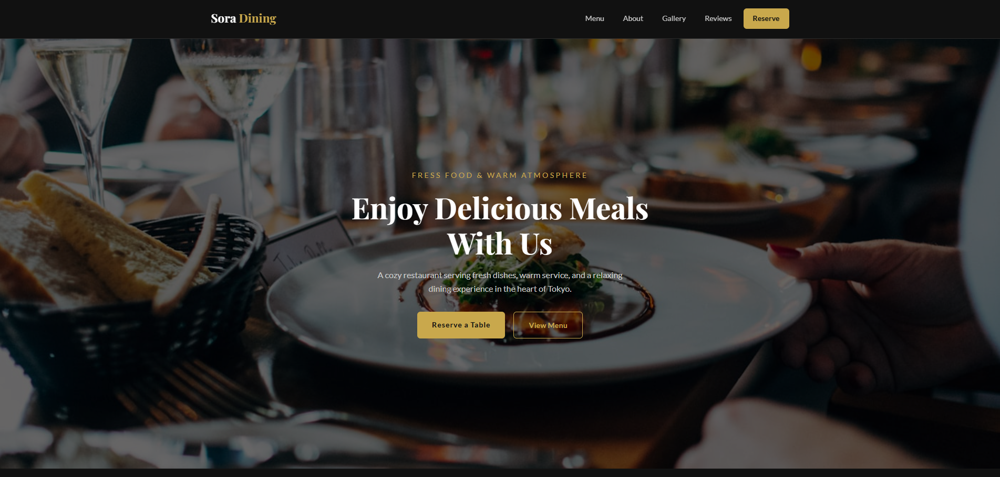
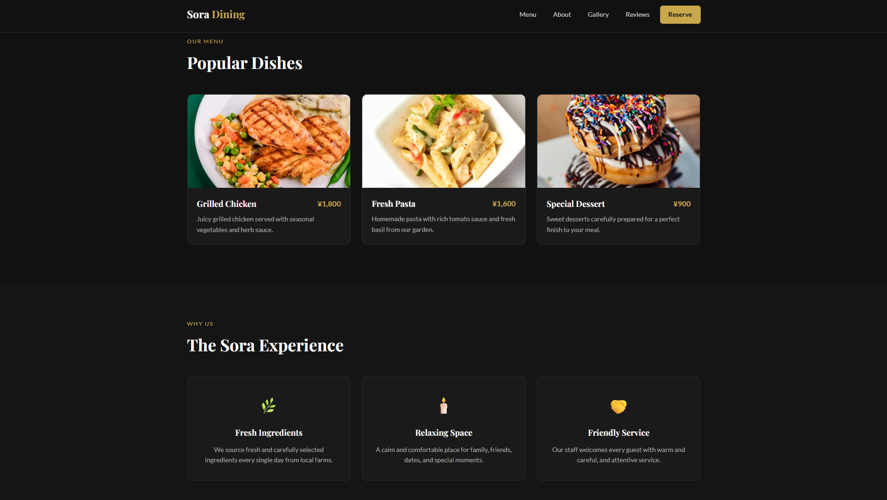
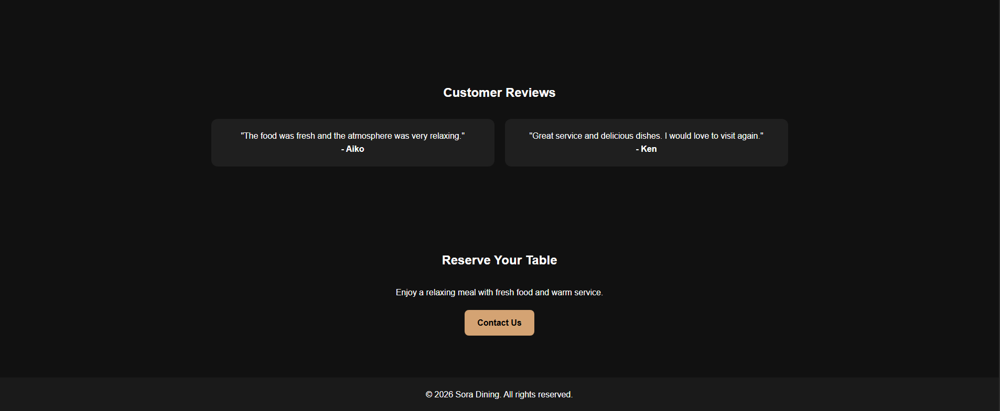

# Restaurant Landing Page

A responsive restaurant landing page built with HTML and CSS.

## Live Demo
https://kkato0219.github.io/restaurant-landing-page/

## Features
- Responsive navigation layout
- Hero section with background image
- Popular dishes section
- Why choose us section
- Customer reviews section
- Reservation call-to-action section
- Clean dark-themed design

## Technologies Used
- HTML5
- CSS3
- Flexbox
- CSS Grid

## Screenshots

### Hero Section
()

### Popular Dishes Section
()

### Reviews & Reservation Section
()

## What I Learned
Through this project, I practiced building a different landing page layout compared to my previous projects.
I focused on section structure, hero design, and creating a more modern restaurant-style UI.