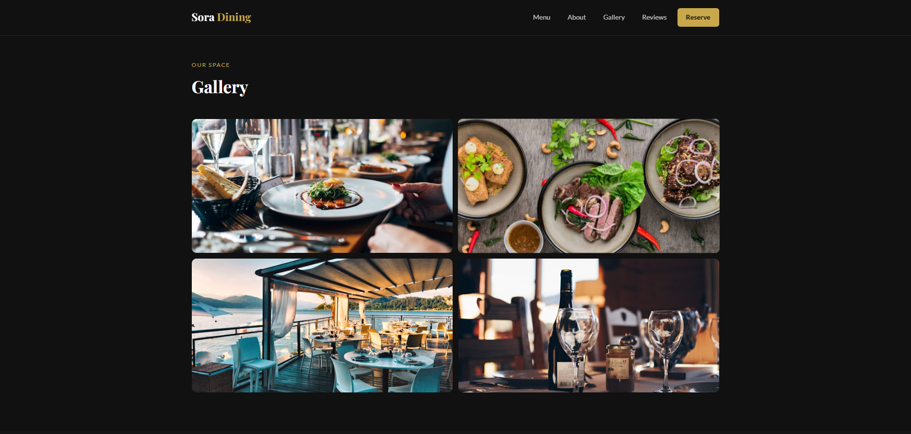
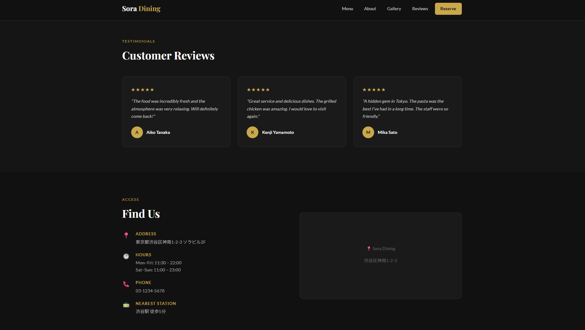
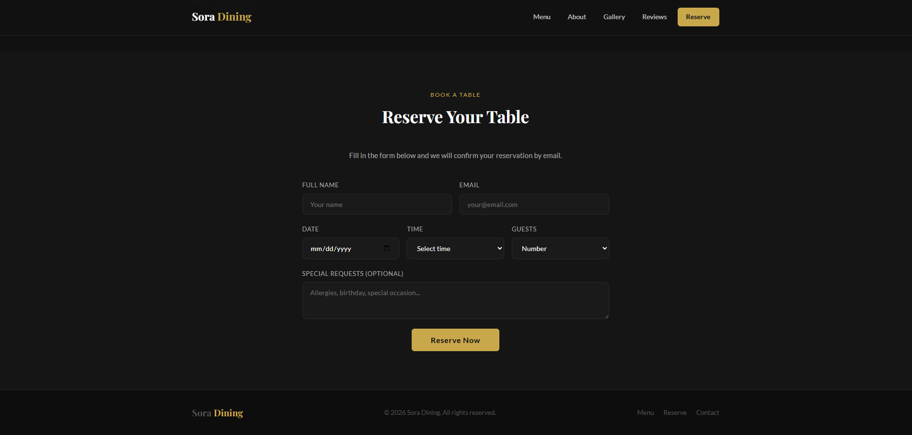

# Sora Dining — Restaurant Landing Page

A modern restaurant landing page with a dark gold theme, built with HTML and CSS.

## Live Demo
https://kkato0219.github.io/restaurant-landing-page/

## Features
- Sticky navigation with Reserve button
- Hero section with full-screen background image
- Popular dishes section with images and prices
- Why choose us section
- Photo gallery section
- Customer reviews section (3 reviews)
- Access / location info section
- Reservation form with success message
- Fully responsive design (mobile friendly)
- Smooth hover animations

## Technologies Used
- HTML5
- CSS3
- Google Fonts (Playfair Display, Lato)
- Flexbox
- CSS Grid

## What I Learned
- How to build a multi-section LP from scratch
- Dark theme design with gold accent colors
- How to build a working reservation form
- CSS Grid for gallery and dish card layouts
- Responsive design with media queries

## Screenshots

### Hero Section

